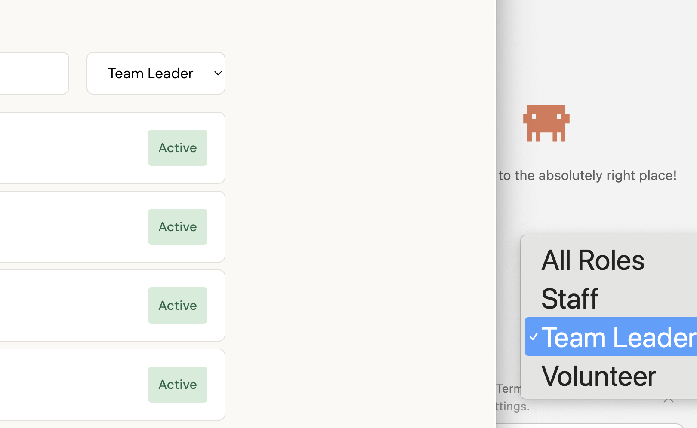

# todo

## Quick wins

- Add the assigned volunteers to the display of the tasks in the volunteer call.

- Change pulldowns/combo boxes to svelte rendered for visual consistency

## Deployment / operations

- **Scheduled-warmer for Cloud Run.** Avoid `min-instances=1` (always-on, ~$5–10/mo) by keeping the instance warm only during expected usage windows.
  - **Cloud Scheduler** cron job: `*/5 9-19 * * 5-0` (every 5 min, 9am–7:59pm, Fri/Sat/Sun) hits `/health` (or a dedicated `/warm`) endpoint. First 3 Scheduler jobs are free; this is one job.
  - **Frontend heartbeat** while a session is active — fetch `/health` every ~4 min so an active user keeps the instance warm beyond the scheduled window (covers e.g. a user who logs in at 8:55pm).
  - **Animated "Loading…" UX** on first hit to absorb the cold-start gap outside the window. Measure actual FastAPI + SQLAlchemy + asyncpg cold-start time before committing — 800ms–1.5s is realistic, not 500ms.
  - **Estimated cost: $0/mo** within Cloud Run free tier — ~143 hours/month of warm time × poll-only CPU usage stays under the 180k vCPU-seconds free allowance. Holds only if the database stays on Neon free tier; Cloud SQL adds $7–9/mo on its own.
  - Caveat: Cloud Run's idle-instance eviction is best-effort; 5-min polls are well within the ~15-min keepalive but not guaranteed. Confirm by watching cold-start counts after deploy.

## CI / CD

- Set up GitHub Actions for this project, modelled on `../rtaff/.github/workflows/`:
  - `ci.yml` — backend job (Postgres service, `make lint-be`, `make test-backend`, codecov upload),
    frontend job (`make lint-fe`, `make test-frontend`), and a type-generation verification job.
  - `deploy.yml` — Docker build to GHCR + GCP Artifact Registry, Cloud Run deploy on `v*` tags.
  - Dependabot config for npm + uv lockfiles.

## Security

- **CSRF tokens** for cookie-authenticated POST/PUT/PATCH/DELETE. Cookie session is SameSite=Lax, which blocks the obvious cross-site cases, but isn't a substitute for explicit CSRF tokens before any state-changing public form lands.
- **Referrer-Policy: no-referrer-when-downgrade** (or stricter) so URL tokens — while they're being phased out — don't leak via Referer header.
- **CSP headers** to reduce XSS blast radius. Frontend uses inline `<style>` blocks heavily; will need a `nonce` strategy or a build-time extraction.
- **Notification filtering by volunteer program** — the WAITING-calls list currently shows every call regardless of program membership. Filter to the volunteer's `program_memberships`.
- **Pause-date enforcement on availability submit** — `pause_start`/`pause_end` exist but aren't checked when a paused volunteer POSTs to `/availability`.

## End-to-end testing

- Decide whether `frontend/e2e/demo.spec.ts` runs in CI (headless) or stays manual-only for the demo recording use case.
- Wire whichever choice into `make test-e2e` so it's discoverable.

## Backend tests

- `backend/tests/conftest.py` has no Postgres test-DB fixture (tests run against aiosqlite). Route coverage hovers in the 20–40% range. Add a Postgres test-DB fixture (mirroring rtaff's CI service pattern) and write integration tests for:
  - `send-invites` transitions OPEN → WAITING and rejects ASSIGNED / ARCHIVED.
  - `send-invites` recipient query filters by `call.program` membership.
  - `POST /send-assignment-notices` requires ASSIGNED status and returns counts.
  - `assignment-overview` includes `available_volunteers` filtered correctly.
  - `GET /people/{id}` never serializes `calendar_url` even after `PUT /calendar`.
  - `GET /volunteer-calls/{id}/calendar/conflicts` enforces self-only access.
  - `DELETE /volunteer-calls/{id}` cascades through tasks, availabilities, assignments.
  - `PUT /people/{id}/calendar` returns 422 on unreachable / non-iCal URLs.

## UI / UX follow-ups

- **Avatar menu (gear icon) settings.** Move user-specific settings — notification kind (email/sms, detailed/brief, Pause (instead of subscription)), calendar connection,  — into the Avatar menu. Maybe retain one line hint on the volunteer-call view: "See user settings to connect your calendar to detect conflicts."
- **Make the menu more Avatar Material Design.**
- **UI design review** — make things prettier and consistent (but better than) the rtaff.org website. Notion-style header backgrounds, etc.
- **Address autocomplete** on `TaskEntryForm` (city is hardcoded; address is plain text pending a source).
- **"Add to calendar" — fuller integration.** Today the button downloads an `.ics` the user has to click again. Investigate provider-specific deeplinks (Google/Outlook/Apple add-event URLs) so a single click actually adds the event.

## Calendar

- **Recurring-event expansion.** `services/calendar.py::parse_ics` reads DTSTART/DTEND only, no RRULE expansion. Volunteers with weekly standing meetings on their calendar will only conflict on the *first* occurrence. Add `recurring-ical-events` (or equivalent) once a user reports the issue or the conflict view goes beyond ~30-day windows.
- **Cross-timezone correctness.** `services/calendar.py::_task_window` assumes naive task times are UTC. The volunteer-call use case is regional (NoVA), so a single TZ would be fine — store the project TZ in settings and apply it when building task windows.
- **Multi-instance cache.** `_cache` is process-local; a multi-replica Cloud Run deploy re-fetches per instance. Acceptable for current volume; revisit when bills show up.
- **Multiple calendar connections per person.**

## Notifications

- **SMS notification stubs** — implement / wire up so the existing `NotificationPreference.SMS` / `BOTH` paths actually deliver.

## Additional tasks, need some design discussion

### Way to resend a request for a particular task, when someone becomes unavailable

Spec needed: re-notify only volunteers who didn't respond for *this* task (skipping already-assigned and already-said-no), or re-blast the whole program? Most likely a button on the assign view next to under-staffed tasks.

### Gamification

Badges and other things. 10 weeks "calls in a row", 20 weeks, 52 weeks…. Kahuna, every task in a week? Put badges on the login for the volunteer, add in the email somewhere. (Fairness badges from the assign view already exist — extend into streak/career-volume badges.)

## Housekeeping

- Check merge status and clean up branches.
